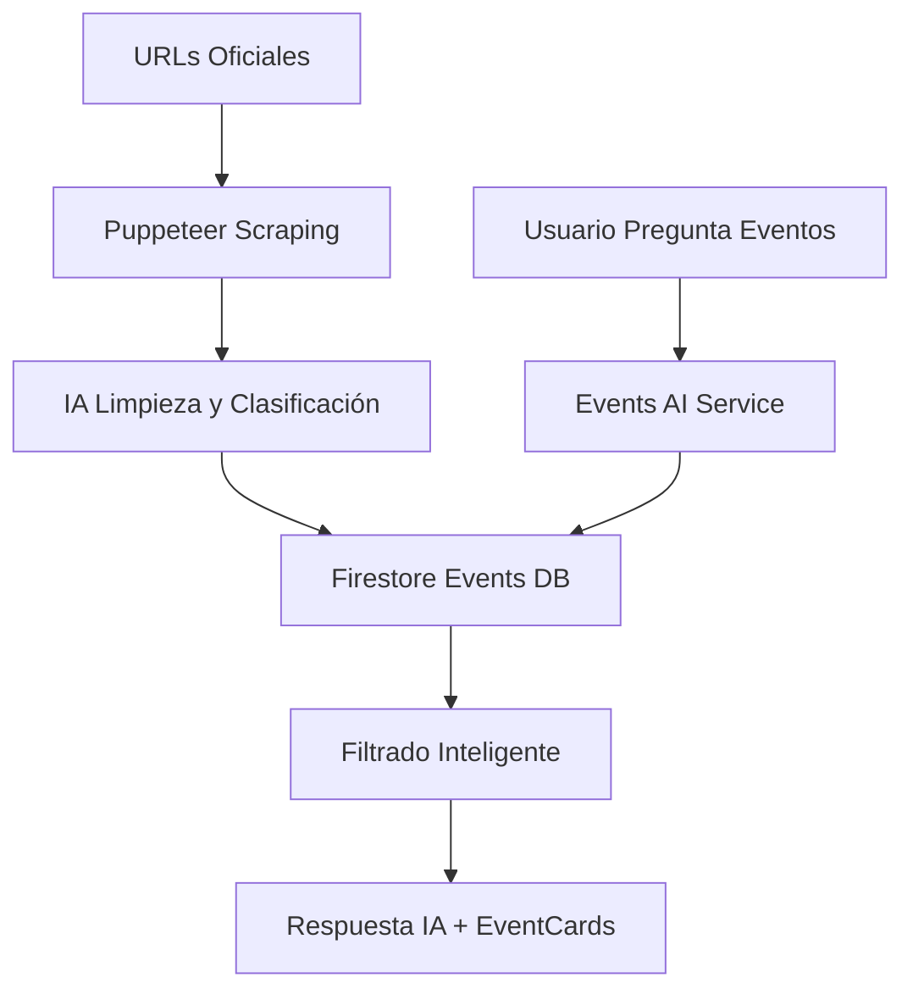

# 🎪 Sistema de Eventos con Firestore

## 📋 Resumen del Sistema

He implementado un **sistema completo de calendario de eventos** que centraliza toda la información de eventos en Firestore, eliminando la dependencia del scraping en tiempo real y mejorando significativamente la experiencia del usuario.

## 🏗️ Arquitectura del Sistema

### 1. **Base de Datos de Eventos (Firestore)**
```typescript
interface ProcessedEvent {
  id: string;                    // ID único
  title: string;                 // Título del evento
  date: string;                  // YYYY-MM-DD
  endDate?: string;              // Para eventos de varios días
  time?: string;                 // HH:MM - HH:MM
  location?: string;             // Ubicación
  description?: string;          // Descripción
  category?: string;             // teatro, concierto, cultural, etc.
  imageUrl?: string;             // URL de imagen
  sourceUrl: string;             // URL fuente original
  eventDetailUrl?: string;       // URL de detalles
  citySlug: string;              // Identificador de ciudad
  cityName: string;              // Nombre de ciudad
  isActive: boolean;             // Estado activo/inactivo
  isRecurring: boolean;          // Evento recurrente
  tags: string[];                // Tags para búsqueda
  createdAt: Date;               // Fecha de creación
  updatedAt: Date;               // Última actualización
  scrapedAt: Date;               // Última extracción
}
```

### 2. **Flujo de Datos**



## 🔧 Componentes Implementados

### 1. **EventsService** (`eventsService.ts`)
- **Scraping coordinado**: Extrae eventos de múltiples URLs
- **IA de limpieza**: Usa Gemini 2.5 Flash para normalizar datos
- **Gestión Firestore**: Guarda, actualiza y consulta eventos
- **Deduplicación**: Evita eventos duplicados
- **Validación**: Solo eventos futuros y válidos

### 2. **EventsAIService** (`eventsAIService.ts`)
- **Consultas inteligentes**: Analiza la intención del usuario
- **Filtrado avanzado**: Por fecha, categoría, palabras clave
- **Respuestas contextuales**: IA genera respuestas naturales
- **EventCards**: Formato optimizado para la UI

### 3. **Cloud Functions** (`eventsCloudFunctions.ts`)
- **Procesamiento manual**: Para admins
- **Scraping automático diario**: 6:00 AM todos los días
- **APIs de consulta**: Para obtener eventos
- **Estadísticas**: Métricas del sistema
- **Limpieza automática**: Elimina eventos antiguos

### 4. **Integración Principal** (`index.ts`)
- **Detección automática**: Reconoce consultas sobre eventos
- **Priorización**: Firestore primero, fallback a scraping en vivo
- **Compatibilidad**: Mantiene formato existente de EventCards

## 🚀 Funcionalidades Principales

### ✅ **Para Usuarios**
- **Consultas naturales**: "¿Qué eventos hay este fin de semana?"
- **Filtros inteligentes**: Por categoría, fecha, palabras clave
- **Respuestas rápidas**: Sin esperas de scraping
- **EventCards**: Formato visual atractivo
- **Información actualizada**: Base de datos sincronizada diariamente

### ✅ **Para Administradores**
- **Procesamiento manual**: Actualización on-demand
- **Estadísticas**: Métricas de eventos por ciudad
- **Logs detallados**: Seguimiento de todo el proceso
- **Configuración flexible**: URLs de eventos por ciudad

### ✅ **Para el Sistema**
- **Scraping diario**: Automático a las 6:00 AM
- **Limpieza semanal**: Elimina eventos antiguos los domingos
- **Fallback robusto**: Si falla Firestore, usa scraping en vivo
- **Escalabilidad**: Maneja múltiples ciudades simultáneamente

## 📊 Cloud Functions Disponibles

### 1. **processEventsManual**
```typescript
// Llamada manual para procesar eventos (admins)
const result = await processEventsManual({ citySlug: 'villajoyosa' });
```

### 2. **processEventsDailyScheduled**
```typescript
// Scraping automático diario programado
// Ejecuta todos los días a las 6:00 AM (Madrid)
```

### 3. **getEventsForCity**
```typescript
// Obtener eventos de una ciudad
const events = await getEventsForCity({ 
  citySlug: 'villajoyosa',
  limit: 20,
  category: 'teatro' 
});
```

### 4. **getEventsStats**
```typescript
// Estadísticas de eventos
const stats = await getEventsStats({ citySlug: 'villajoyosa' });
```

## 🔄 Flujo de Trabajo Diario

### **6:00 AM - Scraping Automático**
1. **Obtener ciudades activas** con URLs de eventos configuradas
2. **Scraping con Puppeteer** de todas las URLs
3. **Limpieza con IA** (Gemini 2.5 Flash):
   - Normalizar títulos y fechas
   - Clasificar por categorías
   - Generar tags
   - Validar información
4. **Guardar en Firestore** con deduplicación
5. **Marcar eventos pasados** como inactivos
6. **Logs detallados** del proceso

### **Consultas de Usuarios (Todo el día)**
1. **Detección automática** de consultas sobre eventos
2. **Búsqueda inteligente** en Firestore:
   - Filtros por fechas
   - Categorías
   - Palabras clave
   - Períodos (hoy, mañana, fin de semana)
3. **Respuesta de IA** contextual + EventCards
4. **Fallback** a scraping en vivo si es necesario

### **Domingos 2:00 AM - Limpieza**
1. **Eliminar eventos** de más de 30 días
2. **Logs de limpieza** para auditoria

## 🎯 Mejoras Implementadas

### **Antes (Scraping en Vivo)**
❌ Tiempo de respuesta: 15-30 segundos  
❌ Fallos frecuentes de scraping  
❌ Respuestas inconsistentes  
❌ Sin filtros inteligentes  
❌ Información no estructurada  

### **Después (Sistema Firestore)**
✅ Tiempo de respuesta: 1-3 segundos  
✅ Datos siempre disponibles  
✅ Respuestas consistentes y estructuradas  
✅ Filtros inteligentes por IA  
✅ Base de datos centralizada y confiable  
✅ Scraping optimizado en background  
✅ Fallback robusto  

## 🔧 Configuración por Ciudad

En la colección `cities` de Firestore, cada ciudad debe tener:

```json
{
  "slug": "villajoyosa",
  "name": "La Vila Joiosa",
  "isActive": true,
  "agendaEventosUrls": [
    "https://www.villajoyosa.com/evento/",
    "https://www.villajoyosa.com/agenda/"
  ]
}
```

## 📈 Beneficios del Sistema

### **Para la Experiencia del Usuario**
- ⚡ **Respuestas instantáneas** sin esperas
- 🎯 **Filtros inteligentes** por fecha, categoría, ubicación
- 📱 **EventCards optimizadas** para móvil y desktop
- 🔄 **Información siempre actualizada** desde fuentes oficiales

### **Para la Escalabilidad**
- 🏗️ **Arquitectura robusta** que maneja múltiples ciudades
- 📊 **Base de datos centralizada** fácil de consultar
- 🔄 **Procesamiento en background** que no afecta la experiencia
- 📈 **Métricas y logs** para optimización continua

### **Para el Mantenimiento**
- 🛠️ **Administración simplificada** con funciones dedicadas
- 📊 **Estadísticas detalladas** de uso y rendimiento
- 🔍 **Logs completos** para debugging
- ⚙️ **Configuración flexible** por ciudad

## 🚀 Siguiente Pasos Recomendados

1. **Configurar URLs** de eventos para cada ciudad activa
2. **Ejecutar procesamiento manual** inicial para poblar la base de datos
3. **Monitorear logs** del scraping diario
4. **Ajustar categorías** y tags según los datos reales
5. **Optimizar filtros** basándose en consultas de usuarios
6. **Expandir a más fuentes** de eventos si es necesario

El sistema está completamente implementado y listo para usar. La IA ahora podrá proporcionar respuestas de eventos rápidas, precisas y actualizadas usando la base de datos centralizada en Firestore.